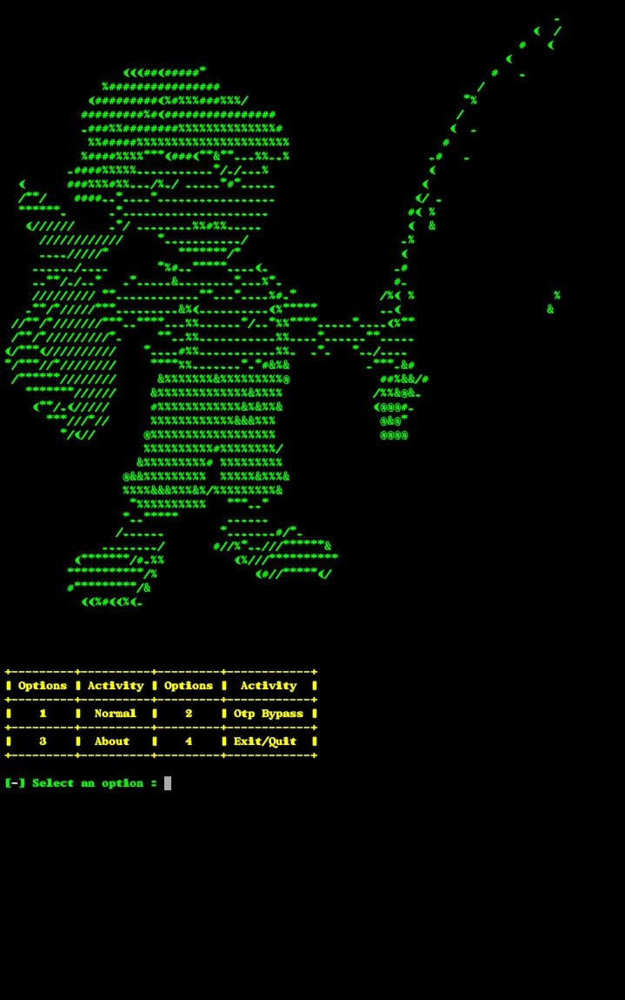

<!-- PROJECT LOGO -->
<br />
<p align="center">
  <a href="https://github.com/Ba-hub/Fish3rMan.git">
    
  </a>

  <h3 align="center">3xcutable</h3>

  <p align="center">
    3xecutable - Help to Compile your Programs & Outputed Windows Executeable file For 32bit or 64bit Both 
    <br />
</p>

### Prerequisites

* gcc
  ```sh
  apt-get install gcc
  ```

### Installation
1. Clone the repo
   ```sh
   git clone https://github.com/Ba-hub/3xecutable.git
   ```
2. Compile the Script
   ```sh
   gcc -o 3xecuteable arch64_execute.c 
   ```
3. Output `3xecuteable`
   ```sh
   ./3xecuteable
   ```

<!-- LICENSE -->
## License

Distributed under the MIT License. See `LICENSE` for more information.


<!-- CONTACT -->
## Developer 
```

Made By ~ Ghosthub

```

